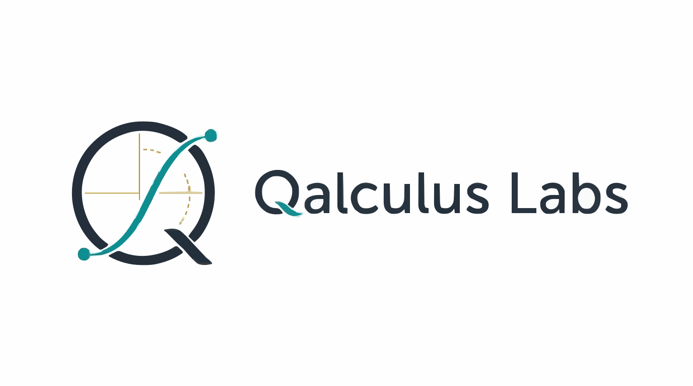

# 

# 
Qalculus Labs

Mathematics, data systems, and AI systems built with rigor.

Qalculus Labs is an independent product and research initiative based in Nepal.

We are building systems for serious analytical work, with a focus on clarity,
reviewability, and real-world usefulness. This repository is the public home of
Qalculus Labs. It shares who we are, what areas we work in, and the boundaries
we keep around private implementation and unpublished research.

## What Qalculus Labs works on

### Qalculus Data Systems

Qalculus Data Systems is our product direction for mathematical and analytical
work in governed data environments. The aim is to help teams run important work
more deliberately, with stronger visibility into how results are produced and
reviewed.

### Qalculus AI Systems

Qalculus AI Systems is our longer-horizon systems direction around dependable
AI, intelligent infrastructure, and future computational workflows. This area
is being developed carefully and remains separate from released product claims.

### Qalculus Research

Qalculus Research covers three broad directions: applied research, theoretical
research, and quantum research. It gives us room to pursue foundational ideas
that matter over the long term while keeping public statements disciplined and
concrete.

## Public documents

- [Product Brief](docs/PRODUCT_BRIEF.md)
- [Qalculus AI Systems](docs/AI_SYSTEMS.md)
- [Qalculus Research](docs/RESEARCH.md)
- [Progress and Public Claims](docs/EVIDENCE.md)
- [AI-Assisted Development](AI_ASSISTED_DEVELOPMENT.md)
- [Security Policy](SECURITY.md)
- [License](LICENSE.md)

## Public boundary

This repository does not publish private product code, internal infrastructure,
credentials, customer data, or unpublished core research. Public material here
is intentionally written at the level of vision, direction, and approved
disclosure.

## Contact

For research discussion, technical evaluation, or future collaboration, email
[paudelg09@gmail.com](mailto:paudelg09@gmail.com).

Copyright (c) 2026 Qalculus Labs
